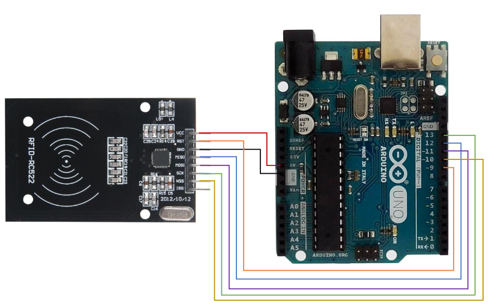

# Name of the file

**Level** : 

The RC522 is a RFID reader.

## What does it do ? ✨

This is a template to read the unique identifier of compatible RFID tags.

## What hardware is needed ? 💾 🔌

- An arduino
- A RC522
- A computer

## Software dependencies 🌈 📂

- the arduino IDE

## How to run ? 🚀

- install the library for the RC522 from [https://github.com/miguelbalboa/rfid](https://github.com/miguelbalboa/rfid)
  - use the green "Code" button to download the `.zip` of the project
  - in the arduino IDE use `Sketch > Include Library > Add .ZIP Library...`

## How to modify ? 🔩 🔨

The id is stored as a number inside the `uid` variable. You can base yourself on that.
