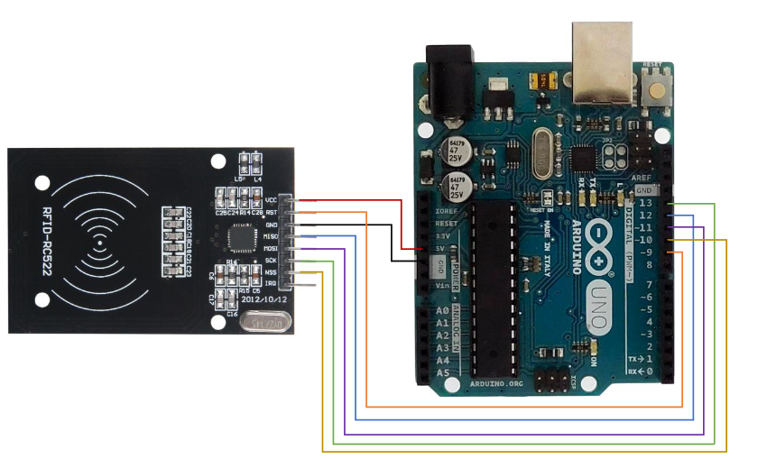

# RC522 presence detection

**Level** : 

## What does it do ? ✨

This goes slightly beyond the basic example to keep detecting the tag or detecting there isn't a tag anymore. Because as it stands, the default examples only allow you to detect the arrival of a tag but not it's departure.

## What hardware is needed ? 💾 🔌

- An arduino
- A RC522
- A computer

## Software dependencies 🌈 📂

- the arduino IDE

## How to run ? 🚀

- install the library for the RC522 from [https://github.com/miguelbalboa/rfid](https://github.com/miguelbalboa/rfid)
  - use the green "Code" button to download the `.zip` of the project
  - in the arduino IDE use `Sketch > Include Library > Add .ZIP Library...`

## How to modify ? 🔩 🔨

The provided `poll()` function will return 0 if there is no tag or the id of the tag as a 32bit unsigned integer.
