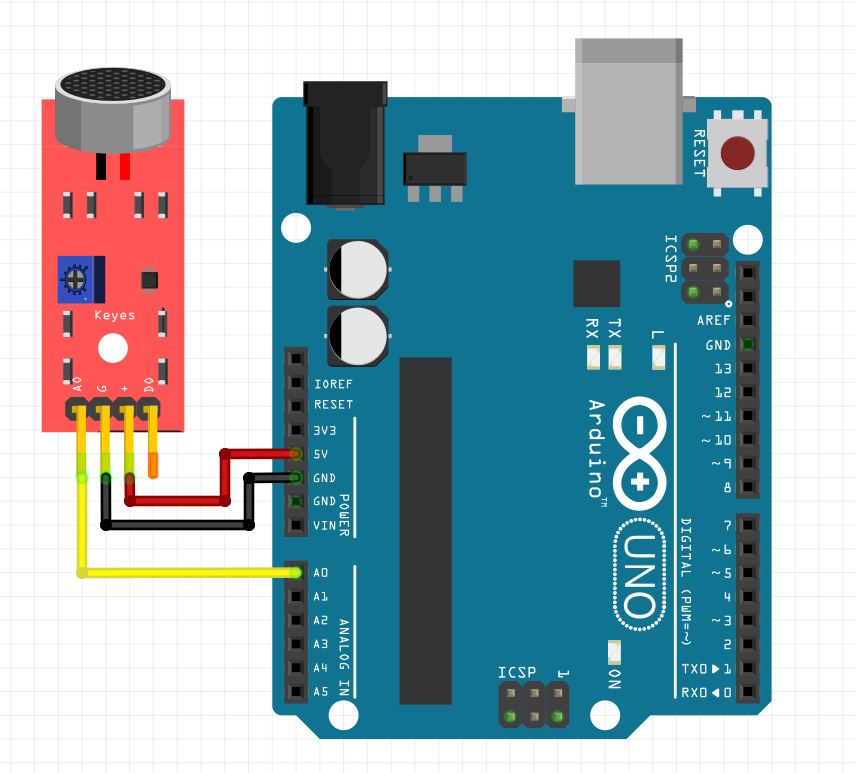

# Loudness from microphone

**Level** : 

## What does it do ? ✨

In this arduino sketch we do a bunch of reading on the microphone, look at the maximum voltage difference we can get in these samples, and use it as the noise level.

## What hardware is needed ? 💾 🔌

- a breakout electret microphone
- an arduino uno

## Software dependencies 🌈 📂

None

## How to run ? 🚀

The usual, reproduce the circuit and open the sketch with the arduino IDE.

## How to modify ? 🔩 🔨

You can change the value of `SAMPLE_COUNT` at the beginning.

## Be Careful ⚠️

More samples will allow you to catch bigger differences but will make the execution of the `loop()` function longer.
