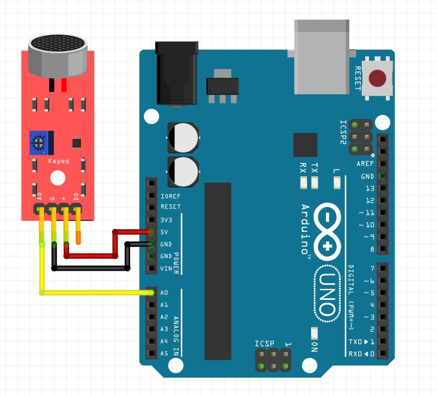

# Loudness from microphone with groupings

**Level** : 

## What does it do ? ✨

This one goes even further than "Loudness from microphone with ring buffer" by having a ring buffer of grouped readings (called "buckets" in this sketch).

The ring buffer doesn't contain readings but a struct representing the result of a bunch of readings. Each roud of the `loop()` we do enough reading to refresh one bucket.

Which means:

- the `loop()` function executes even faster than in "loudness from microphone with ring buffer"
- the footprint on the memory is significantly smaller than in "loudness from microphone with ring buffer. For the same 100 samples total it takes 10% of the memory on an arduino uno when it's divided into 5 buckets.
- you get more control about the speed/memory charectestics of the sketch:
  - more samples per bucket will slow down the speed of the `loop()` function
  - more buckets will take more memory

## What hardware is needed ? 💾 🔌

- a breakout electret microphone
- an arduino uno

## Software dependencies 🌈 📂

None

## How to run ? 🚀

The usual, reproduce the circuit and open the sketch with the arduino IDE.

## How to modify ? 🔩 🔨

You can change the value of `BUCKET_COUNT` and `SAMPLES_PER_BUCKET` at the beginning.
