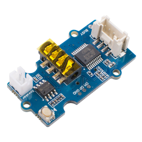

# seeed studio MP3 V3

**Level** : 

## What does it do ? ✨

This template shows how to use the mp3 player v3 from seeed studio. It differs with the template given in their documentation in that it is compatible with ESP32 boards and should also be a bit friendlier to modify.

## What hardware is needed ? 💾 🔌

Just the mp3 player, your dev board of choice (either an arduino or an ESP32) and some cables.

## Software dependencies 🌈 📂

This template relies on a specific version of the library provided by seeed studio and might now be compatible with the latest version they have published.

The lib is provided with the template, no need to install anything, just keep them together if you want it to keep working.

## How to run ? 🚀

As usual, just open it in your arduino IDE, you know the drill.
