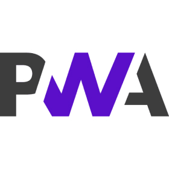

# Minimal PWA

**Level** : 

## What does it do ? ✨

This is the simplest PWA(Progressive Web App) starter possible. Everything in there is required to make it installable. Outside of that it's just a simple web page.

## Software dependencies 🌈 📂

None!

## How to run ? 🚀

It's just a dead simple web page. Run it with a development server. Although it will only be installable if you're accessing it through the "localhost" address or a HTTP**S** connexion.

## How to modify ? 🔩 🔨

Just like any HTML/CSS/JS website

## Additional resources 📄 📗

https://developer.mozilla.org/en-US/docs/Web/Progressive_web_apps

## How you could improve the template 🦾

This most minimal approach doesn't even need a service worker. We would need one to make it work offline.
