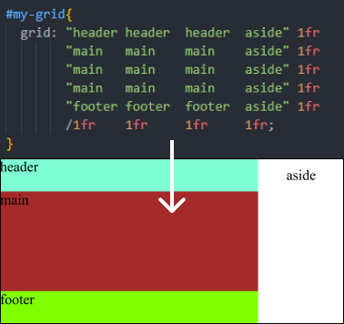

# Name of the file

**Level** : 

## What does it do ? ✨

CSS grids have multiple uses. The most common is to lay elements on a classic typographical grid.

But this shows how you can (ab)use the `grid` shorthand to write a grid that directly looks like the UI you want to build.

## How to run ? 🚀

Like any html/css/js project, you could open the file straight from your file browser, or through a development server.

## Additional resources 📄 📗

https://developer.mozilla.org/en-US/docs/Web/CSS/CSS_grid_layout/Basic_concepts_of_grid_layout#fixed_and_flexible_track_sizes