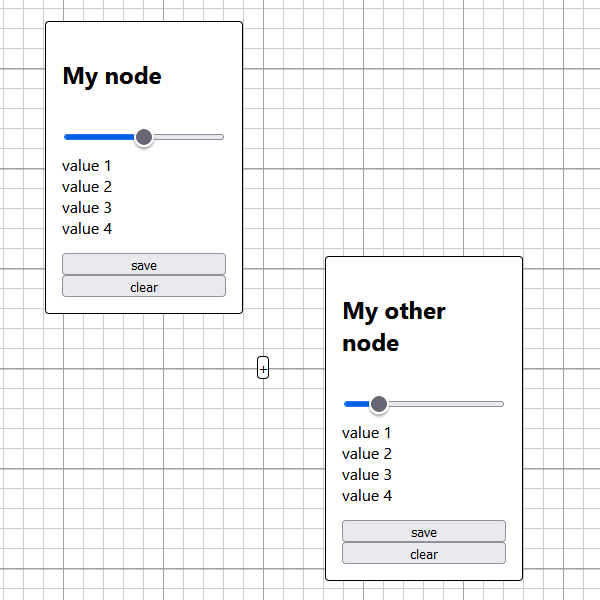

# Infinite HTML viewport

**Level** : 

;

## What does it do ? ✨

Have you seen web pages which are infinite in all directions and in which you can drag elements around?

This template gives you a base for making such applications. It is 100% vanilla JS with no library so it will be easier to deeply understand how it works, nothing hidden uder the rug!

Also, this is HTML-based not \<canvas\>-based which means we can use all the accessibility features of the web.

## Software dependencies 🌈 📂

None!

## How to run ? 🚀

You need to serve the project for it to work. Two simple approaches would be to either use the LiveServer extension for Visual Studio Code or copy the project into one of yours on Repl.it.

## How to modify ? 🔩 🔨

Assuming you just want to use the template and not extend it, you can just put your HTML elements as usual into the `
` and your element will be draggable by default. If you want them to stay where they are you can add the data attribute `data-fixed` like this `
I AM NOT DRAGGABLE
`

The pattern in the background is controled by the class `pattern-background`. This is the only piece of code in the project that wasn't really meant to be read and you are encourage to just change it for something else if you don't like it.

## How one could improve the template 🦾

There is a lot of stuff that could be done. If you want to try contributing but don't feel confident about your capacity please do not hesitate to contact me (Valentin Dupas) and I'll provide guidance on how you can get to a point where you can comfortably extend this project.

Anyway, here is a list of things the project dosen't do but would be nice to have (from easiest to most difficult):

- multiple element selection
- zooming out

- insert new element into the viewport
  - and then saving elements from the viewport
- allowing the user to modify edit elements
  - allowing the user to insert elements into each others
- connecting elements (possibly with svg paths?)
  - allowing the chaining of nodes to enable custom visual scripting (possibly execute this visual code into a web worker?)
